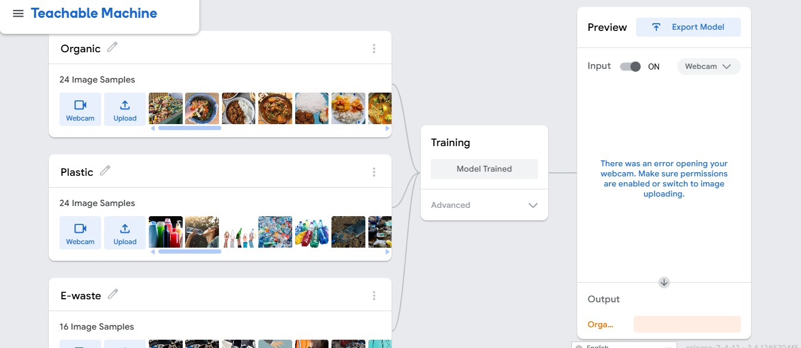
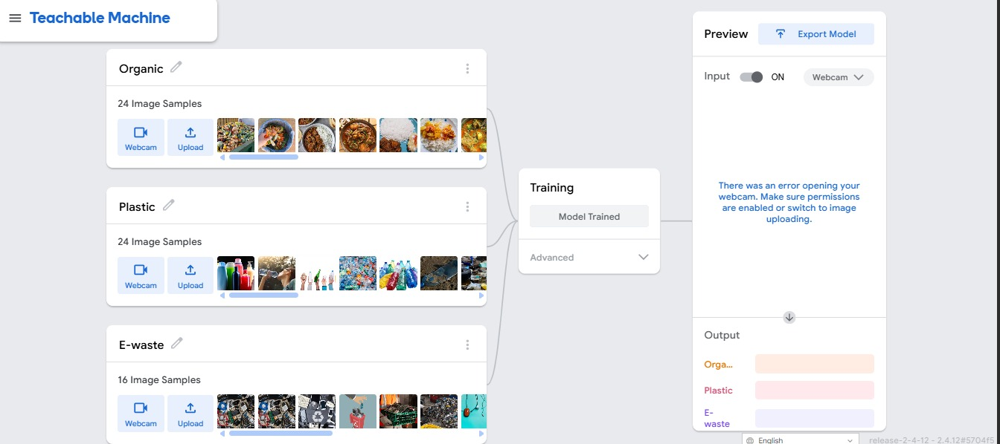
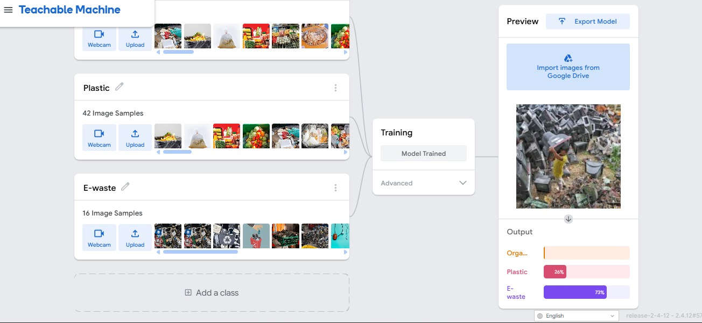
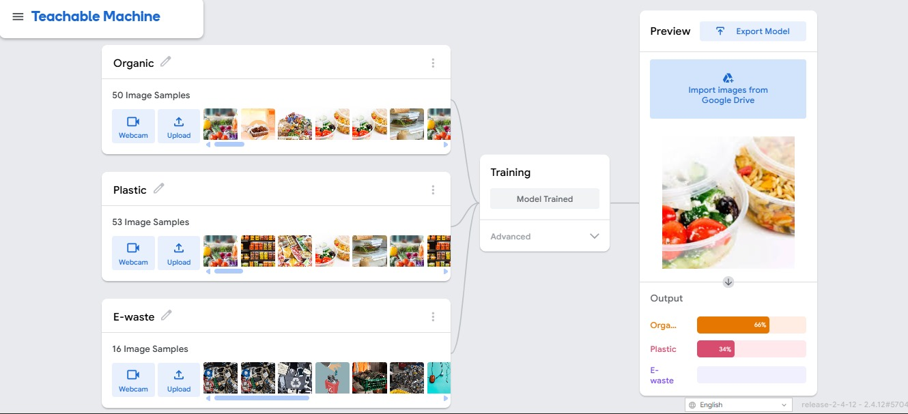

# Waste2Worth

Waste2Worth is a role-based food waste management platform built for hack Data V1. It helps kitchens predict demand, log leftovers, review safety decisions, route surplus food to NGOs, classify waste, and track operational impact from a single workflow.

The project is designed as a practical hackathon demo with a clear product story: reduce edible waste, move safe food into donation flows, and send non-donatable material into the correct recovery stream.

## What The Platform Does

Waste2Worth combines four connected workflows:

1. Meal prediction for kitchens and event operators.
2. Surplus intake and human safety review.
3. NGO handoff and pickup management.
4. AI waste scanning and recycler routing.

The experience is role-aware, so each user sees the tools that matter to them instead of a generic dashboard.

## Core Capabilities

- AI-assisted food planning and prediction.
- Leftover capture with safety classification support.
- Human decision review for final disposition.
- NGO request and collection flows.
- Waste image classification through Teachable Machine or Google Vision.
- Recycler job routing for non-donatable waste.
- Reward points and impact analytics for operational visibility.
- Auth-protected dashboards with role-based access control.

## User Roles

| Role | Main Experience |
| --- | --- |
| Kitchen | Plan meals, add leftovers, review decisions, send safe surplus, and scan waste. |
| NGO | Review incoming requests, manage accepted pickups, and track fulfillment. |
| Recycler | View waste jobs, process routed waste, and follow operational status. |
| Admin | Monitor the broader system through analytics and cross-role views. |

## Main Screens

- Dashboard overview with daily stats and recent activity.
- AI food prediction flow.
- Leftover logging and safety review.
- Donation handoff workflow.
- NGO dashboard and request management.
- Recycler hub for waste operations.
- Rewards and analytics views.
- Login and role selection screen.

## Tech Stack

- Next.js 14
- React 18
- TypeScript
- Tailwind CSS
- Prisma with PostgreSQL
- NextAuth
- Supabase client integration
- Motion animations
- Radix UI and custom UI components
- Recharts for analytics visuals
- TensorFlow.js and Google Vision support for waste classification

## Architecture Notes

- The home route redirects users based on authentication state.
- Middleware protects dashboard pages and API routes.
- Role-based navigation is driven from the shared application context.
- The app supports a lightweight hackathon auth mode so the product can be demonstrated quickly, while still allowing a database-backed auth flow when needed.

For a deeper, judge-facing breakdown of the architecture, workflows, data model, and technical strengths, see [docs/SYSTEM_DESIGN.md](docs/SYSTEM_DESIGN.md).

## Getting Started

### 1. Install dependencies

```bash
npm install
```

### 2. Create your environment file

Create a `.env.local` file in the project root and add the variables listed below.

### 3. Prepare the database

If you are using the full database-backed flow, make sure `DATABASE_URL` points to a real PostgreSQL database, then run:

```bash
npm run prisma:generate
npm run prisma:migrate
```

If you only need schema syncing for local experimentation, `npm run prisma:push` is also available.

### 4. Start the app

```bash
npm run dev
```

The development server runs on port `3002`.

## Environment Variables

The code references the following variables:

| Variable | Purpose |
| --- | --- |
| `NEXTAUTH_URL` | Canonical app URL for NextAuth in local and deployed environments. |
| `DATABASE_URL` | PostgreSQL connection string used by Prisma. |
| `NEXTAUTH_SECRET` | Required by NextAuth and middleware token checks. |
| `NEXT_PUBLIC_SUPABASE_URL` | Public Supabase project URL. |
| `NEXT_PUBLIC_SUPABASE_ANON_KEY` | Public Supabase anon key. |
| `HACKATHON_SIMPLE_AUTH` | Keeps the lightweight demo auth flow enabled unless set to `false`. |
| `WASTE_AI_PROVIDER` | Chooses the waste classifier: `teachable_machine` or `vision`. |
| `TEACHABLE_MACHINE_MODEL_URL` | Base URL for the Teachable Machine model. |
| `GOOGLE_VISION_API_KEY` | Required when `WASTE_AI_PROVIDER=vision`. |

Recommended hackathon setup:

```bash
NEXTAUTH_URL=http://localhost:3002
HACKATHON_SIMPLE_AUTH=true
WASTE_AI_PROVIDER=teachable_machine
```

For Teachable Machine, point `TEACHABLE_MACHINE_MODEL_URL` to the model base URL. For Google Vision, switch `WASTE_AI_PROVIDER` to `vision` and provide `GOOGLE_VISION_API_KEY`.

The minimal local configuration for the demo flow is `NEXTAUTH_URL`, `NEXTAUTH_SECRET`, `DATABASE_URL`, `NEXT_PUBLIC_SUPABASE_URL`, and `NEXT_PUBLIC_SUPABASE_ANON_KEY`. The AI provider variables are only needed if you want to run the waste scan feature with real inference.

## Available Scripts

```bash
npm run dev
npm run build
npm run start
npm run lint
npm run prisma:generate
npm run prisma:migrate
npm run prisma:push
```

## Project Structure

- `app/` contains the Next.js routes, dashboard layouts, and API endpoints.
- `app/(auth)/login` handles sign-in and role selection.
- `app/(dashboard)` contains the protected product experience.
- `lib/` holds shared services for auth, Prisma, RBAC, AI classification, and API helpers.
- `prisma/schema.prisma` defines the data model for organizations, memberships, surplus batches, decisions, pickups, waste scans, and rewards.
- `styles/` contains the global visual system.

## Hackathon Context

This codebase was prepared for hack Data V1 as a product demo with clear value proposition and live workflow coverage. The focus is on showing how a food waste platform can connect prediction, donation, recovery, and analytics in one operational system.

## Notes

- If `DATABASE_URL` still contains placeholder values, the Prisma layer will warn during local development.
- If you are using Supabase PostgreSQL, the example `.env.example` shows both a direct host URL and a pooler format. Use the one that matches your network setup.
- The waste scan API supports both direct classification mode and persisted batch-linked mode.
- If you switch off simple auth, make sure your database contains valid users, organizations, and memberships.

## AI Classification With Custom Machine Learning on Data Using Teachable Machine

This project uses custom machine learning classification on project data through Teachable Machine to support the waste scan workflow. The images below are included as the visual reference set for the hackathon demo.









  