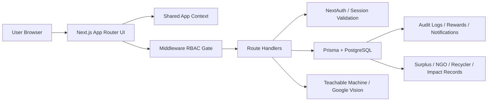

# Waste2Worth System Design

Waste2Worth is a role-based food waste management platform designed as a connected operational system rather than a set of isolated pages. The core idea is to move food through a controlled lifecycle: predict demand, capture leftovers, review safety, route safe food to NGOs, route unsafe material to waste recovery, and track the impact of those actions over time.

The architecture is intentionally split into clear layers so the product can be judged on structure, modularity, scalability, and real-world feasibility.

## 1. Executive Overview

The platform is built on Next.js 14 with the App Router, React 18, TypeScript, Tailwind CSS, Prisma, PostgreSQL, and NextAuth. It combines three important characteristics:

1. A role-aware user experience for Kitchen, NGO, Recycler, and Admin users.
2. A transactional backend that records state transitions and audit trails.
3. Pluggable AI services for meal prediction and waste classification.

At a high level, the system is designed to answer one question: what should happen to food or waste after a kitchen event produces it?

## 2. High-Level Architecture

The system is layered so each responsibility is isolated:

- Presentation layer: route pages under `app/`.
- Shared client state: `app/context/AppContext.tsx`.
- Security layer: `middleware.ts`, `lib/auth.ts`, and `lib/api-auth.ts`.
- Business logic layer: route handlers in `app/api/`.
- Persistence layer: `prisma/schema.prisma` and Prisma client in `lib/prisma.ts`.
- AI layer: `lib/teachable-machine.ts` and `lib/vision.ts`.

This is a strong architecture choice because it keeps authentication, workflow logic, AI integration, and UI concerns separated while still allowing them to cooperate through typed contracts.

## 3. Core Product Flow

The main lifecycle is a closed loop:

1. A kitchen predicts meal demand.
2. Food is cooked and leftovers are logged.
3. AI suggests whether the surplus is likely safe.
4. A human confirms the final disposition.
5. Safe food becomes an NGO donation flow.
6. Unsafe or non-donatable material becomes a waste flow.
7. Recycler operations process the resulting waste job.
8. Impact and rewards are tracked across the organization.

This is the key system design strength: state transitions are not scattered across random screens. They are modeled as a workflow chain.

## 4. User Roles and Access Model

The platform is role-driven and organization-aware.

- Kitchen users manage predictions, leftovers, decisions, donations, and waste scanning.
- NGO users manage incoming donation requests and pickup scheduling.
- Recycler users manage routed waste jobs and operational status.
- Admin users can observe the system across roles and analytics views.

Role handling is enforced in multiple places:

- `middleware.ts` blocks protected page and API paths.
- `lib/rbac.ts` maps route prefixes to allowed roles.
- `lib/api-auth.ts` ensures server-side handlers require a valid session.
- `types/next-auth.d.ts` extends the session object so role and organization metadata are strongly typed.

This defense-in-depth approach is important because it prevents the UI from being the only access control boundary.

## 5. Authentication and Session Design

Authentication is designed for both hackathon demo mode and production mode.

### Demo mode

When `HACKATHON_SIMPLE_AUTH` is not set to `false`, the app supports a lightweight credentials flow that avoids needing a full production user database during a live demo. This is useful because the judges can still see the full workflow without infrastructure overhead.

### Production mode

When simple auth is disabled, the system uses:

- NextAuth credentials authentication.
- Prisma adapter support.
- bcrypt password verification.
- organization membership lookup.

The session is JWT-based, which keeps the application horizontally scalable and reduces server-side session state dependence.

## 6. Data Model Design

The database schema is the structural core of the platform. It is not a flat CRUD schema. It is a workflow schema with explicit domain entities and status enums.

### Main domain entities

- `User`, `Organization`, `Membership`
- `PredictionInput`, `PredictionOutput`
- `SurplusBatch`, `AiSuggestion`, `HumanDecision`
- `NgoRequest`, `NgoAcceptance`, `Pickup`
- `WasteScan`, `WasteClassification`, `RecyclerJob`
- `RewardEvent`, `PointsLedger`, `ImpactSnapshot`
- `AuditLog`, `Notification`

### Why the schema is strong

1. It enforces valid workflow states with enums.
2. It uses foreign keys and unique constraints to prevent duplicate or invalid records.
3. It supports one-to-one and one-to-many relationships where needed.
4. It includes auditability and impact measurement as first-class concepts.

### Important workflow enums

- `SurplusStatus`
- `DonationSafety`
- `NgoRequestStatus`
- `PickupStatus`
- `WasteType`
- `RecyclerJobStatus`
- `RewardEventType`

These enums make the system more reliable because each business process has a constrained state machine.

## 7. Backend Service Design

The backend logic lives in route handlers under `app/api/`. These handlers are the real business engine of the app.

### Prediction service

File: `app/api/predictions/route.ts`

This service accepts attendance, weather, event, weekday, and historical meal data, then creates both the input and generated output in a single transaction. It also creates an audit log record.

Strengths:

- Validation with Zod.
- Atomic database writes.
- Clear separation between input and output records.
- Easy to replace the heuristic predictor with a real model later.

### Surplus intake service

File: `app/api/surplus/route.ts`

This service records leftover food and produces an AI safety suggestion based on freshness and quantity. It stores the suggestion in a dedicated AI suggestion row and records the event in the audit log.

Strengths:

- Encapsulates business logic in a server route rather than inside the UI.
- Persists both user input and AI output.
- Supports future replacement of the heuristic safety function with a stronger model.

### Human decision service

File: `app/api/decision/route.ts`

This is the most important branching point in the architecture. It converts a surplus batch into one of two paths:

- SAFE: create an NGO request, mark donation approval, and grant reward points.
- NOT_SAFE: create or reopen waste scan and recycler job records.

The handler runs inside a transaction so the decision, side effect, and status update all succeed or fail together.

### NGO request service

File: `app/api/ngo-requests/route.ts`

This service lets NGOs view incoming requests and accept a request. Acceptance creates or updates acceptance, pickup scheduling, and donation status records.

### Recycler job service

File: `app/api/recycler-jobs/route.ts`

This service exposes recycler workload and updates job state as waste moves through the recovery process.

### Waste scan service

File: `app/api/waste-scan/route.ts`

This is the AI-heavy service. It accepts image uploads, validates size and format, chooses a provider, classifies the waste, and optionally persists the scan to a specific surplus batch.

The service supports two operation modes:

- Direct demo classification, where the UI can show results quickly without a linked batch.
- Persisted classification, where the result is attached to an existing batch and the operational state is updated.

That dual-mode design is practical for hackathon demos and production evolution.

## 8. AI Subsystem

Waste2Worth is intentionally provider-agnostic for waste classification.

### Teachable Machine path

File: `lib/teachable-machine.ts`

This path loads a TensorFlow.js model, caches the model and metadata globally, decodes images, resizes them, runs inference, and maps the predicted label into an operational waste category.

Design strengths:

- Model and metadata caching reduces repeated startup cost.
- Image normalization is handled consistently.
- Fallback decoding improves reliability across image formats.
- The output is mapped into business-readable recommendations.

### Google Vision path

File: `lib/vision.ts`

This path uses Vision API label detection, then applies domain rules to convert labels into waste categories and routing recommendations.

Design strengths:

- Easy to swap from one provider to another.
- Works as a fallback or production option.
- Keeps the application from being tied to a single inference backend.

### Why this matters

The AI layer is not mixed directly into the UI. It sits behind service boundaries, which is the right approach if the system is later expanded to use a custom model endpoint, an image pipeline, or batch inference jobs.

## 9. Frontend Architecture

The UI is built as a role-based dashboard suite under the App Router.

### Layout and shell

- `app/layout.tsx` defines the root document and metadata.
- `app/providers.tsx` wires `SessionProvider`, `AppProvider`, and the toast system.
- `app/(dashboard)/layout.tsx` provides the protected dashboard shell with role-specific navigation.

### Shared client state

`app/context/AppContext.tsx` is the central client-side state store for:

- role
- login state
- user name
- organization name
- leftover capture state
- predicted meals
- final decision
- total points

This is useful for demo fluency because the user can move through the workflow without requiring every screen to refetch data.

### Screen design

The major screens are intentionally aligned to the workflow:

- Dashboard overview.
- Predict food.
- Add leftover.
- Human decision.
- Send to NGO.
- NGO dashboard.
- Waste scan.
- Recycler hub.
- Analytics.
- Rewards.

The UI is visually polished and role-specific, which helps the product story in a hackathon setting. More importantly, the screen sequence matches the lifecycle of the data model.

## 10. Security and Reliability

Several design choices improve reliability and safety:

### Validation

Zod validation is used in route handlers to reject malformed input before it reaches the database.

### Transactional writes

Core business operations are wrapped in Prisma transactions. This is especially important when one user action needs to create or update multiple records.

### Audit logging

The system logs critical actions such as registration, prediction generation, surplus creation, decision recording, NGO acceptance, recycler updates, and waste classification.

### File safeguards

Waste scan uploads are capped at 5 MB, which is a sensible boundary for both safety and operational efficiency.

### Database resilience

The app includes database-unavailable handling so that local development and production failures degrade more gracefully.

## 11. Scalability Analysis

This architecture is reasonably scalable for a real deployment path.

### Horizontal scalability

- JWT sessions avoid session server lock-in.
- Next.js route handlers are stateless between requests.
- Prisma connects to PostgreSQL, which is a proven scalable data layer.

### Feature scalability

- New roles can be added by extending the role maps and route access rules.
- New AI providers can be added by introducing new service adapters.
- New workflow stages can be added by extending the schema enums and handler transitions.

### Operational scalability

- Audit logs allow observability.
- Impact snapshots support reporting.
- Rewards and points ledger support engagement features.

The system is not yet a full distributed microservices architecture, but that is a good thing for this stage. It is simpler, easier to debug, and cheaper to ship while still being cleanly separated enough to grow.

## 12. Efficiency Analysis

The system makes several efficiency-conscious choices:

- AI model caching avoids repeated expensive loading.
- Transaction scope is limited to the exact records involved in a workflow step.
- The UI uses route-level composition rather than global overfetching.
- Inputs are validated early to prevent invalid downstream work.
- Role-based gating prevents unnecessary data access for unauthorized users.

The result is an architecture that is efficient enough for a hackathon demo and structurally ready for production hardening.

## 13. Strengths for Judges

If you are presenting this system, these are the strongest points to emphasize:

1. The app is workflow-driven, not page-driven.
2. The domain model encodes the real business process.
3. Access control exists at both middleware and API levels.
4. AI is modular and replaceable.
5. Important state changes are transactional and auditable.
6. The platform supports multi-role operations in one coherent system.
7. The design is feasible for real deployment with incremental hardening.

## 14. Honest Limitations

For credibility, it is also worth noting what is still demo-oriented:

- Some dashboard screens are presentation-heavy and use local UI state instead of live API reads.
- Some flows are intentionally simulated for speed and clarity in the hackathon experience.
- Production readiness would require stronger persistence wiring for every UI page, richer notification delivery, and expanded input/output validation around external services.

These are not architectural flaws; they are normal scoping decisions for a demo-heavy build.

## 15. Deployment Path

The current architecture can move toward production in a practical way:

1. Keep PostgreSQL as the source of truth.
2. Replace or harden demo auth with a real identity flow.
3. Connect all role dashboards to live API reads.
4. Add background jobs for async classification or notifications if needed.
5. Introduce monitoring, tracing, and rate limiting for public deployment.
6. Keep AI providers behind stable service interfaces.

## 16. Conclusion

Waste2Worth is architected as a unified operational platform with a clear lifecycle, role-aware access, transactional business logic, and pluggable AI services. Its biggest strength is that the system design mirrors the real-world food waste workflow closely enough to be both understandable in a demo and feasible in production.

The result is a solution that judges can evaluate positively on modularity, scalability, efficiency, and clean workflow design.